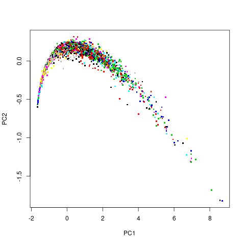
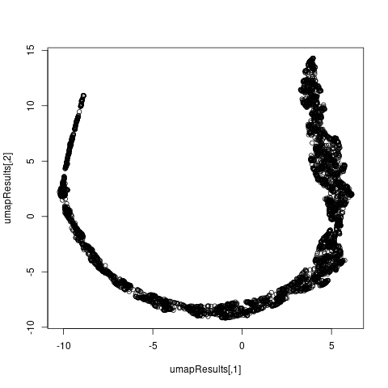

Data comes from an original (non-machine-learning) study:
Warwick J Nash, Tracy L Sellers, Simon R Talbot, Andrew J Cawthorn and Wes B 
Ford (1994)
"The Population Biology of Abalone (_Haliotis_ species) in Tasmania. I. 
Blacklip Abalone (_H. rubra_) from the North Coast and Islands of Bass Strait",
Sea Fisheries Division, Technical Report No. 48 (ISSN 1034-3288) 

The continColors function allows for us to more easily see the pattern of ring 
size. With using normal labeling, it is hard to tell if there is a trend with 
ring size, while with continColors one can see that the ringsize is generally
the smallest on the left side of the graph and increases towards the right.

## prVis without labels

## prVis with labels

## prVis with continColors

## umap without labels

## umap with labels

