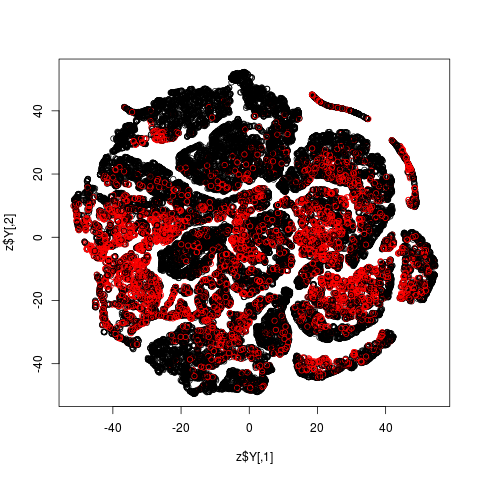
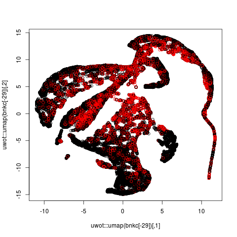

Bank data from UCI Machine Learning Repository.  Goal is to predict
whether a customer will respond to a campaign to open a new type of
account.

Arguably **prVis** gives the best separation of red and black.

