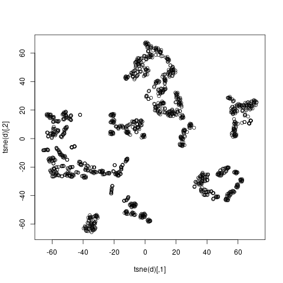
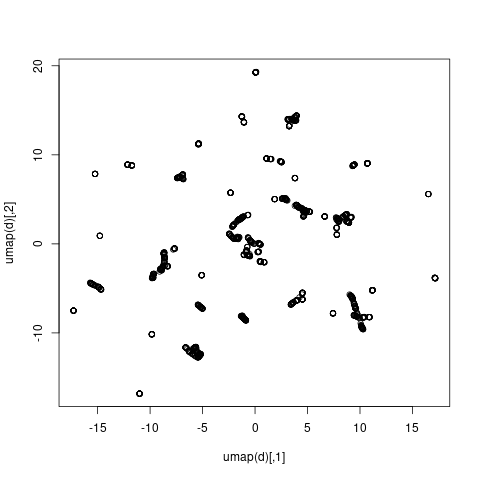
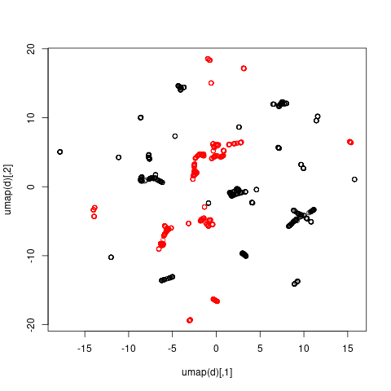

## Data
The graphs in this directory are of 
[banknote authentication](https://archive.ics.uci.edu/ml/datasets/banknote+authentication)
data taken from the UCI machine
learning repository. The data contains variance of Wavelet Transformed Image, 
skewness of Wavelet Transformed Image, curtosis of Wavelet Transformed Image, 
entropy of the image, and whether the banknote was genuine or forged.
There are 1372 rows and 5 columns in this dataset

## Interpretation
Banknotes could fall into two categories in this dataset, approved or rejected.

Tsne seems to be the visualization that does best on this dataset, as the
data appears to be separated into clusters which are either entirely approved
or denied. This implies that we would be able to use the position of a
datapoint to predict whether or not a banknote would be accepted or rejected
even if we were only using two dimensions.

The results for umap are much more scattered, as the data seems to form a large
number of disparate clusters.

prVis forms two overlapping groups which is not helpful in terms of visually
interpreting this dataset.

## Graphs

### prVis graphs

### tsne graphs

### umap graphs

## Citation
Dua, D. and Karra Taniskidou, E. (2017). UCI Machine Learning Repository 
[http://archive.ics.uci.edu/ml]. Irvine, CA: University of California, School of
Information and Computer Science.
