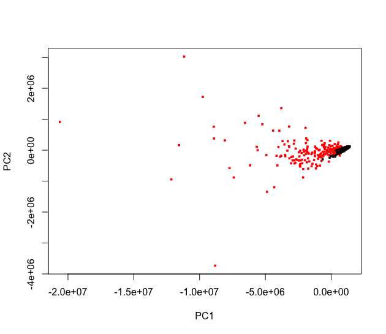
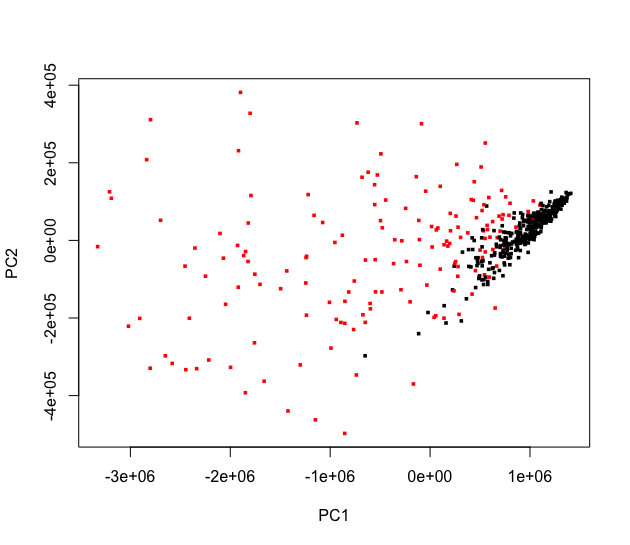
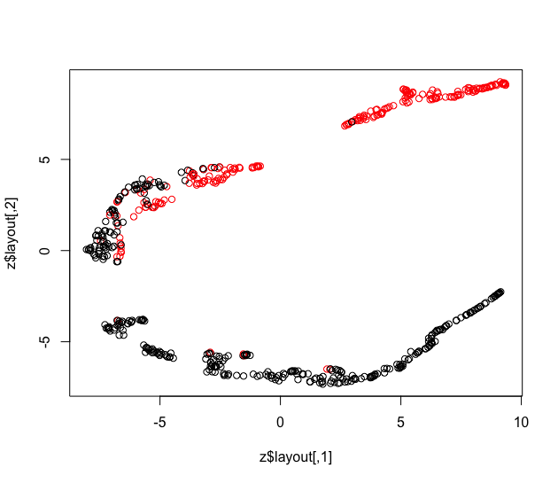
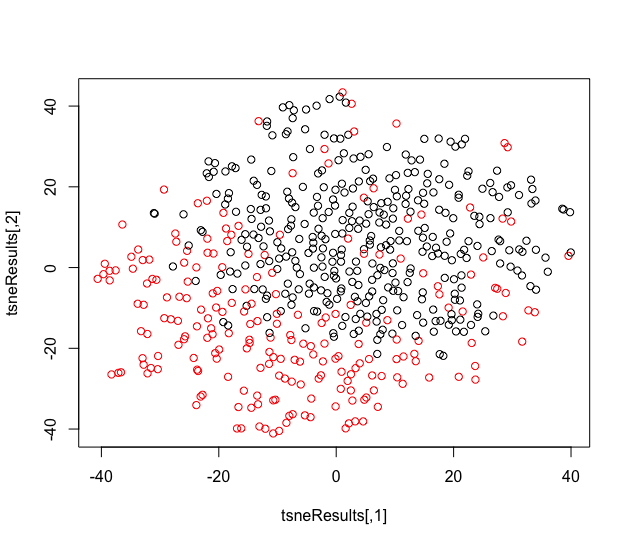

## Data
Data can be found [here](https://www.kaggle.com/uciml/breast-cancer-wisconsin-data). Features are computed from a digitized image of a fine needle aspirate (FNA) of a breast mass. The first column us the patient ID, the second column is the classification in diagnosis: M = malignant, B = benign, and the remaining columns are real-valued features computed for each cell nucleus.

## Graph
#### prVis

prVis shows a good separation of data  

When we try to further zoom in the graph by removing 100 outliers (about 12% of the original dataset), prVis shows a clearer distinction between red(malignant) and black(benign), which may provides us the insight on what distinct them from each other.
#### umap

#### t-sne

