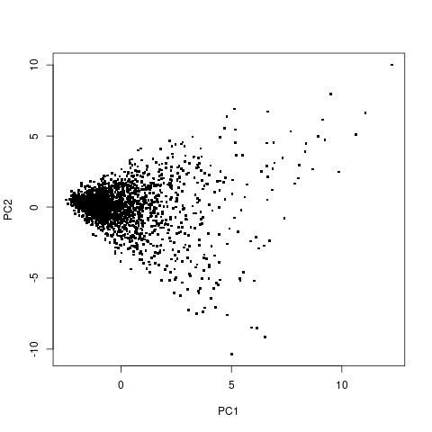
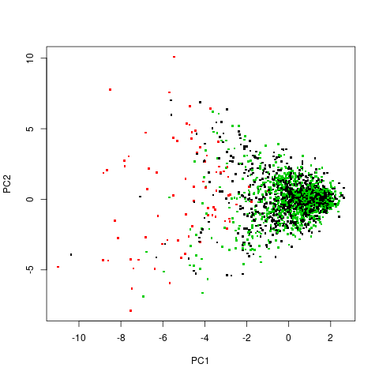
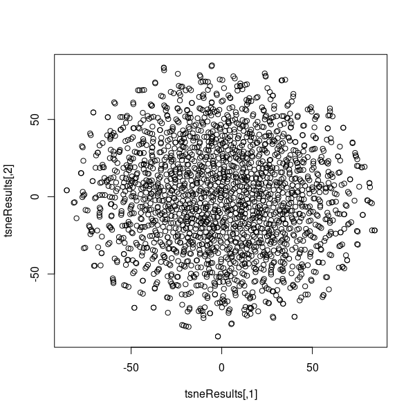
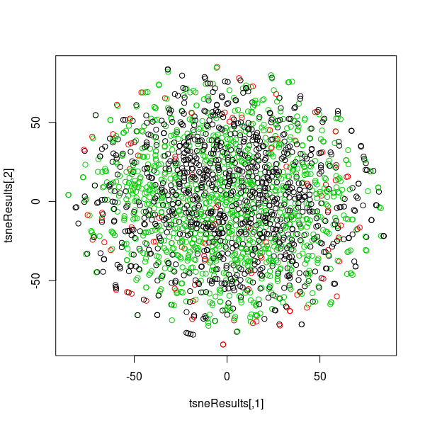
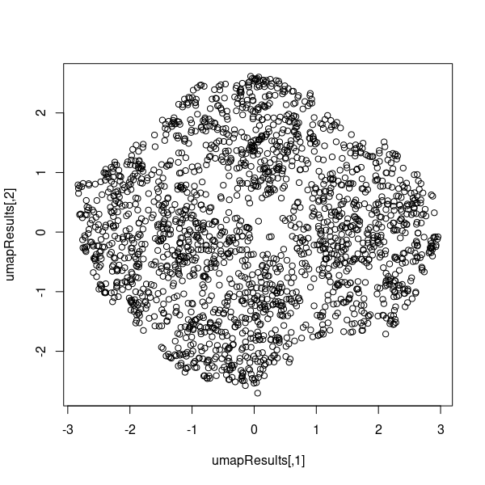
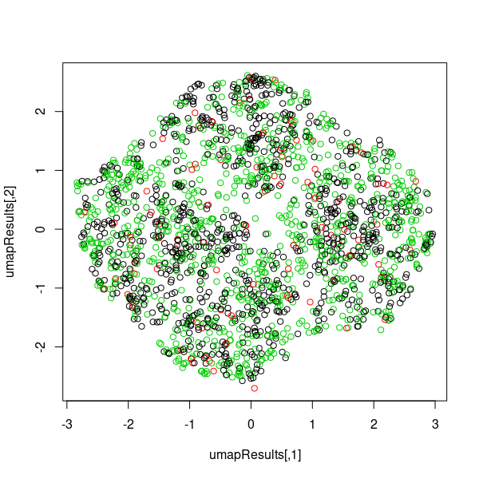

## Data
The graphs in this directory are from a dataset of game states of
connect 4. Each game state is classified as being a win for player 1, a win for
player 2, or a tie. The dataset can be found at 
[dataset link](https://www.kaggle.com/tbrewer/connect-4/home)
The first 42 columns represent the piece located at a point on the board and
the 43rd column represents the player who would go on to win the game. There
are 43 columns and 376,430 rows of data.

## Interpretation
prVis seems to have a pattern that was not present in umap or tsne. As 
datapoints stray further from the main cluster on the righthand side, games
seem more likely to end up being a tie. It seems like games that are likely
to end up in a tie could have a similar structure that is evident even when
viewed only with two principal components

## Graphs

### prVis graphs

### tsne graphs

### umap graphs

