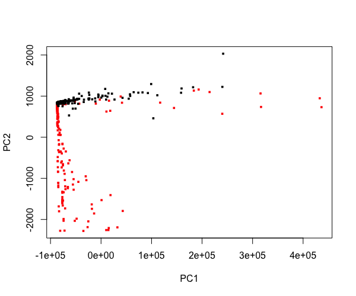
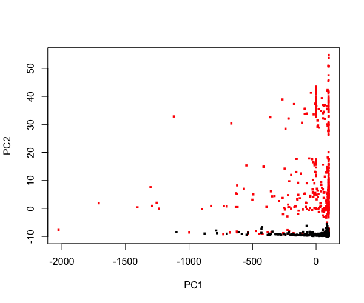
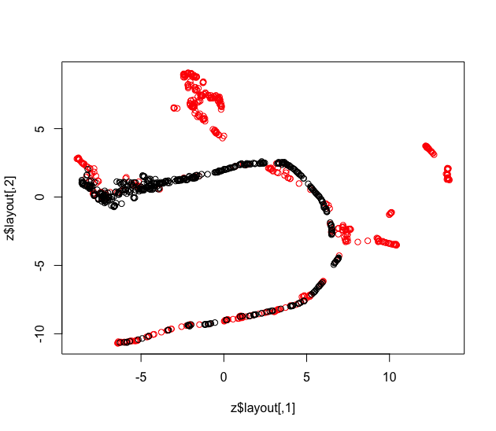

## Data
Data can be found [here](https://www.kaggle.com/mlg-ulb/creditcardfraud). The
datasets contains transactions made by credit cards in September 2013 by
european cardholders. Feature 'Time' contains the seconds elapsed between each
transaction and the **first** transaction in the dataset. Thus, we preprocess
the 'Time' column to be the time needed for each single transaction, rather
than the accumulated time.

Also, since the dataset is highly unbalanced (492 frauds out of 284,807
transactions, which means 492 cases have label 1, and all others have label 0
), we sample the data to make the sample "balanced". Below the graphs consist
of 492 frauds and 492 normal transaction so that for each group they have same
number of data points.

## Graph
#### prVis
  
The two groups are nearly perpendicular to each other, suggesting the distict
natures of the fraud transactions and normal transactions. Whereas the plot
from umap and t-sne reveal no obvious pattern.

#### prcomp

prcomp produces a similar result to prVis, which reminds us that prVis is essentially polynomial regression + PCA. In this case, PCA along can exploit the data, and prVis preserves that advantage. In other dataset such as Swissroll, prVis can uncover nonlinear relationship of the dataset whereas PCA along produces rather meaningless result. 
#### umap

#### t-sne

