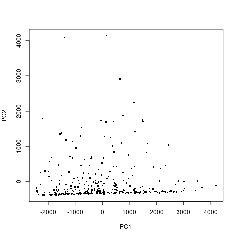
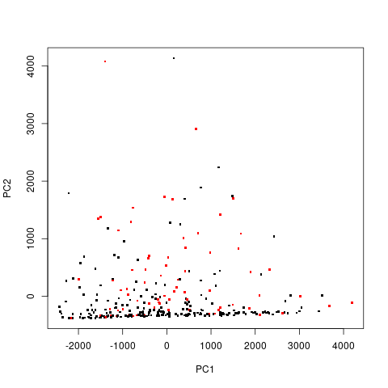
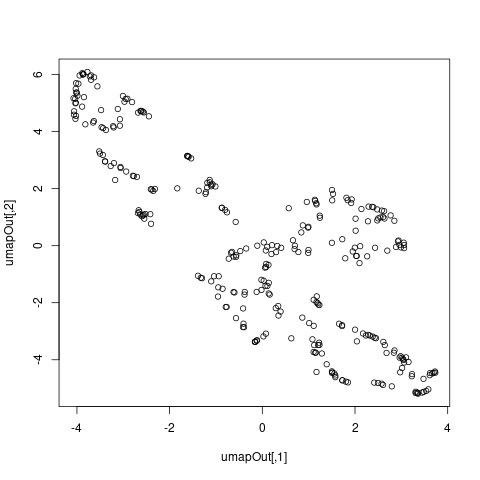
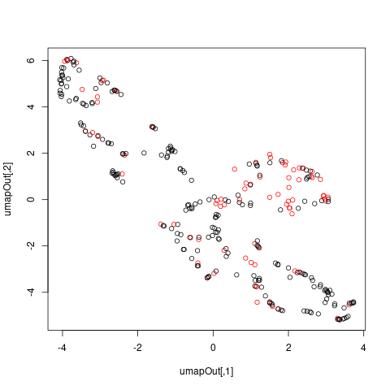
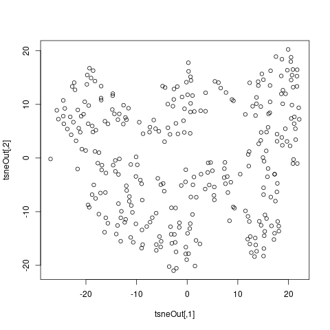
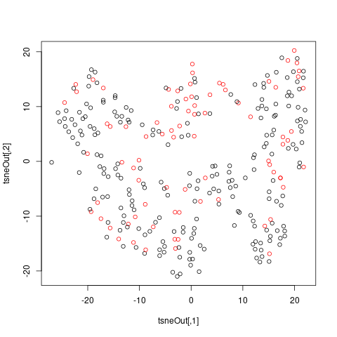

[dataset link](https://archive.ics.uci.edu/ml/datasets/Haberman%27s+Survival)

The dataset contains information from patients who have underwent breast cancer
surgery. In this dataset there are two classes, patients who have survived for
less than 5 years after the surgery, and those who have survived more than 5
years. There are 306 rows and 4 columns: patient age at time of operation,
patient year of operation, number of positive axillary nodes detected, and
survival status.

It is hard to see patterns with any of the visualization tools, which suggests
that we may need more than two dimensions to accurately predict on this
problem, or that the information provided is not directly correlated with the
classes that we are predicting.

## prVis without labels

## prVis with labels

## umap without labels

## umap with labels

## tsne without labels

## tsne with labels

