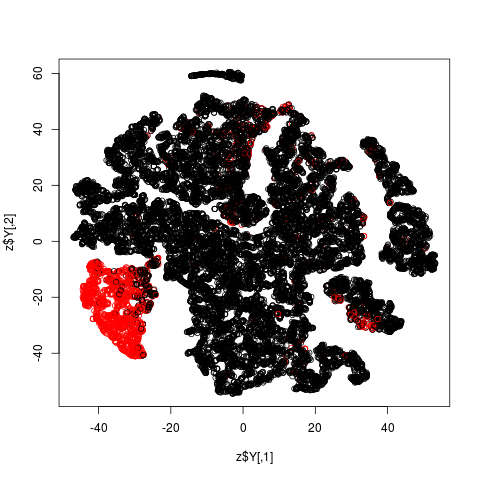
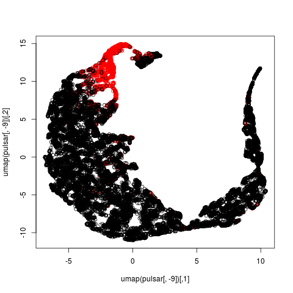
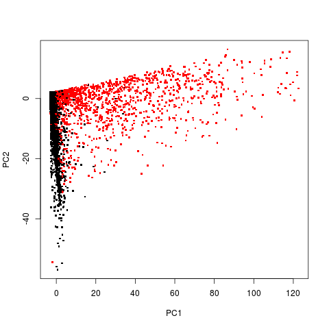
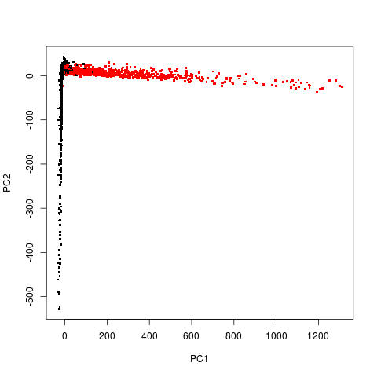

Pulsar data (HTRU2) from UCI Machine Learning Repository.  Goal is to predict
pulsar or non-pulsar star.

All plots give good separation of red and black. But look at the one
using **prVis()** at degree 3!  Even without labels, one would see that
"something is happening."

This also shows that one should get almost perfect prediction using a
polynomial regression model (say logistic) of degree 3.

