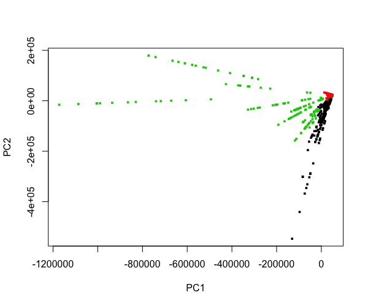

## Data
The dataset collects the total volume of traffic on the stretch of road for the
whole year in Cardiff, UK.
Data can be found at [here](http://www.dft.gov.uk/traffic-counts/download.php).
## Graphs

### prVis

All of the graphs show great separation between groups. Further, if we call the
utility function addRowNums inside the prVis package, we can see some
interesting trends here.
```r
prVis  (dataset, labels = T)
addRowNums(40) # highlighting 40 rows of the dataset, and printing out
                  # the line number highlighted
```

```r
# We choose 4 points lies approximately on the same line horizontally in the graph
dataset[478, ]
#busescoaches linklengthmiles frequency lab
#478       344.56             0.5    689.12   3
dataset[159, ]
#busescoaches linklengthmiles frequency lab
#159       289.85            0.62     467.5   3
dataset[1061, ]
#busescoaches linklengthmiles frequency lab
#1061       183.63            0.62  296.1774   3
dataset[631,]
#busescoaches linklengthmiles frequency lab
#631       154.79            0.81  191.0988   3
```
We can see that as we move along the PC1 from left to right(holding PC2
approximately unchanged), the frequency of each data point decreases.
We can then infer those green points (group 3) on the far left part of the graph
represents the road segments that have high frequency. One application of the
insight is that those road segments may need to be improved because of the
potential traffic jam caused by high volumn traffics.
### tsne


### umap


## Citation
The data preprocessing and inspiration come from Michael Grogan:
http://www.michaeljgrogan.com/uk-traffic-trends-pca/
