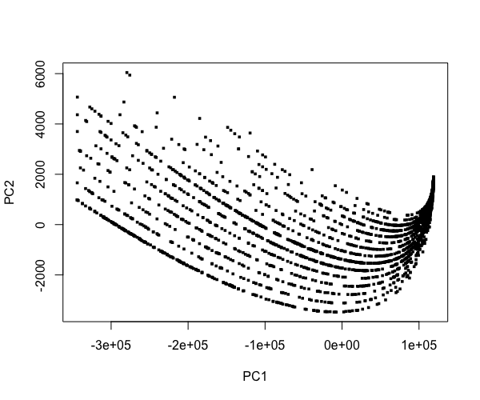

English data from Stanford WordBank, http://wordbank.stanford.edu
Creative Commons license.

(Go to http://wordbank.stanford.edu/analyses?name=vocab_norms and right-click
"Download Raw Data".)

Below, in order, are the plots from **prVis**, UMAP from **uwot** and
UMAP from **umap**.  In the first, we see a number of streaks,
corresponding to different combinations of the categorical variables,
with age changing along a streak.  The other two are snakelike, unclear
meaning.

