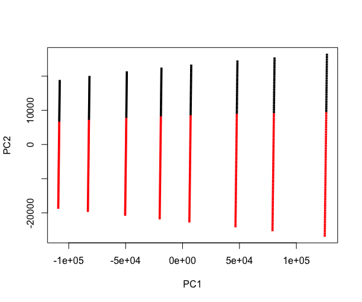
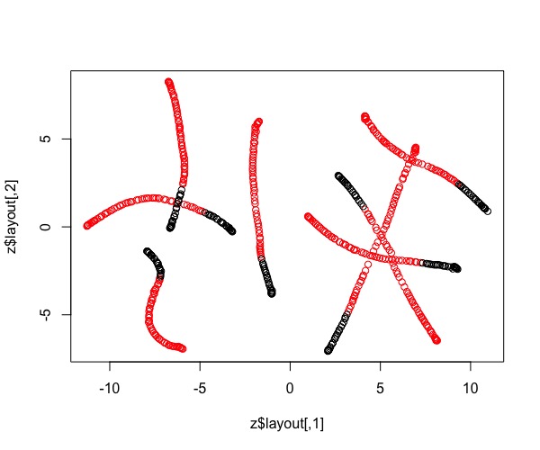
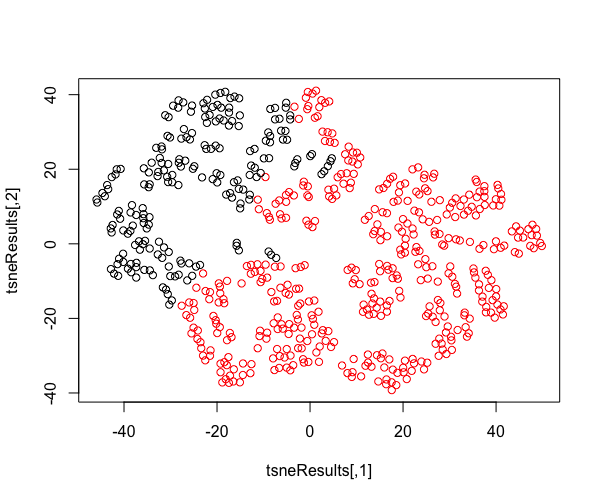

Sitka spruce tree data set from [here](https://vincentarelbundock.github.io/Rdatasets/doc/geepack/sitka89.html). The dataset has three variables describing the experiment units: size (of the tree), time, and id number(of the tree). And they are either treated under ozone environment or treated under ozone-free environment (control group).

Below are the plots from **prVis**, **umap**, and **tsne**, in order.

prVis categorizes the two groups distinctly.

umap has some overlapping between the control group and the treatment group.

tsne also has clear results interms of the categrization. But it takes much longer time to run compared to the previous two.

