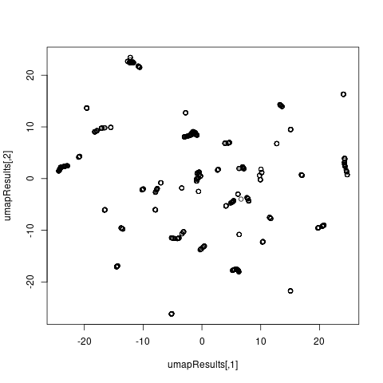

## Data
The graphs in this directory are of 
[iBeacon RSSI readings](https://archive.ics.uci.edu/ml/datasets/BLE+RSSI+Dataset+for+Indoor+localization+and+Navigation)
data taken from the UCI machine learning repository. The data contains location 
and the reading of 13 iBeacons used to triangulate position. There are 6611
rows and 15 columns.

## Interpretation
The iBeacon dataset has a somewhat large number of factors for its
classification due to the factors representing a space on a two
dimensional grid. This translates into there being nearly 400 different 
factors. Viewing results with this many factors might be somewhat difficult.
This dataset is being saved for a further date to see if using addRowNums can
allow us to glean information from a dataset with a large number of factors.

## Graphs

### prVis graphs

### umap graphs

## Citation
Mehdi Mohammadi and Ala Al-Fuqaha, {mehdi.mohammadi, ala-alfuqaha}@wmich.edu
Department of Computer Science
Western Michigan University
